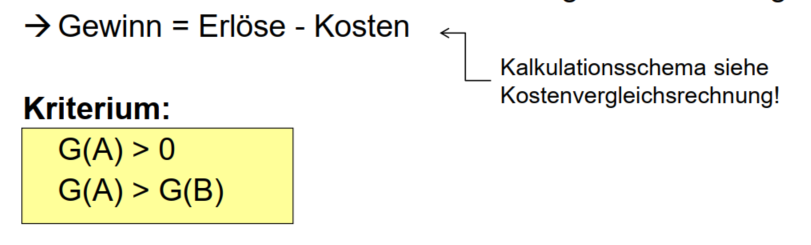
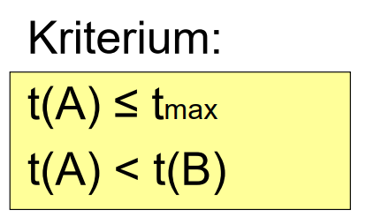
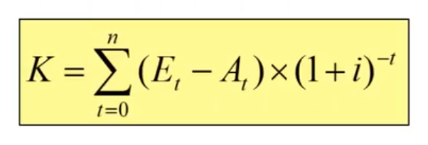
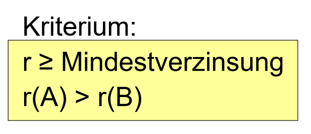

# bwl

## Klausur Fragen

- Bestandskonten

- Eröffnungsbilanz

- Schlussbilanz

- Jahresabschluss

- Gewinnentwicklung

- Deckungsgrad

- Liquiditaet

- Unterschied zwischen der Liquidität 1. Und 2. Grades

- Martksegmentierung

- Gewinnvergleichsrechnung

- Deckungsbeitrag

- Break-even point

- Kostenfunktion

- Wie kann der Staat aktiv eingreifen, um zu verhindern, dass das BIP weniger stark sinkt?

- Drei Entscheidungssituationen

- Vier Felder im klassischen BC-Portfolio

## Wie setzt sich BIP zusammen?

Das Bruttoinlandsprodukt (BIP) umfasst den Wert aller innerhalb
eines Wirtschaftsgebietes während einer bestimmten Periode
produzierten Waren und Dienstleistungen.
(Entstehung)

Privater Verbrauch + Staatsverbrauch + Investitionen + Außenbeitrag
(Verwendung)

## BIP aus der Entstehungs- und aus der Verwendungssicht

## Drei Verfahren der dynamischen Investitionsrechnung

- Amortisationsrechnung
- Interner Zinsfussmethode
- Kapitalwertmethode

## Kapitalgesellschaften

- GmbH
- AG

## Personengesellschaften

- GbR (Gesellschaft bürgerlichen Rechts)
- Partnerschaft
- KG (Kommanditgesellschaft)
- OHG (Offene Handelsgesellschaft)

## Vier Voraussetzungen für eine effiziente Marktsegmentierung

## Welche zwei Barrieren führen oftmals zu Problemen in der organisatorischen Struktur eines Unternehmens?

## Formen der Aussenfinanzierung

Unternehmen nimmt Geld von externen Quellen um Ausgaben zu bezahlen.

- Eigenfinanzierung (Beteiligungsfinanzierung)

- Fremdfinanzierung (Kreditfinanzierung)

## Was ist Eigenfinanzierung(Beteiligungsfinanzierung)?

Externe Investoren investieren Geld in ein Unternehmen und erhalten im Gegenzug Anteile am Unternehmen.

- Private Equity
- Venture Capital
- Public Equity (Bei Unternehmen mit Börsenzugang)

## Was ist Venture Capital?

Investoren geben Geld an junge und innovative Unternehmen mit hohem Wachstumspotenzial, um Anteile am Unternehmen zu erhalten.

## Was ist Public Equity?

Unternehmen sammeln Kapital von der Öffentlichkeit, indem sie Aktien des Unternehmens an der Börse verkaufen.

## Was ist Private Equity

Investoren geben Kapital in bestehende Unternehmen, um sie zu unterstützen und Wertsteigerungen zu erzielen.

## Formen der Fremdfinanzierung(Kreditfinanzierung)

- Langfristige Fremdfinanzierung
  - Darlehen
  - Anleihe
- Kurzfristige Fremdfinanzierung
  - Handelskredite
  - Geldkredite
  - Kreditleihe (Akzept- und Avalkredit)
- Sonderformen (Kreditsubstitute)
  - Factoring
  - Leasing

## Was sind Anleihen/Bonds?

Anleihen sind Schuldtitel, die von Unternehmen, Regierungen oder anderen Institutionen ausgegeben werden, um Kapital von Investoren zu erhalten. Im Gegenzug für das geliehene Geld erhalten die Anleger regelmäßige Zinszahlungen und das Kapital wird ihnen am Ende der Laufzeit zurückgezahlt. Im Unterschied zu Bankkrediten können Anleihen an Börsen gehandelt werden, haben eine festgelegte Laufzeit und bieten eine gewisse Flexibilität für Investoren.

## Formen der Innenfinanzierung

- Selbstfinanzierung
- Finanzierung aus Rückstellungen
- Aus Abschreibungen
- Aus sonstigen Vermögenumschichtungen

## Was ist Selbstfinanzierung?

Selbstfinanzierung ist eine Form der Innenfinanzierung, bei der das Unternehmen seine eigenen Gewinne oder Rücklagen verwendet, um Investitionen zu finanzieren, anstatt externes Kapital aufzunehmen.

## Was ist Finanzierung aus Rückstellungen?

Finanzierung aus Rückstellungen ist eine Form der Innenfinanzierung, bei der das Unternehmen Rückstellungen, die zuvor für bestimmte Zwecke gebildet wurden, nutzt, um neue Investitionen zu finanzieren.

## Was ist Finanzierung aus Abschreibungen?

Finanzierung aus Abschreibungen ist eine Form der Innenfinanzierung, bei der das Unternehmen den Werteverzehr von Vermögensgegenständen (Abschreibungen) nutzt, um Mittel für neue Investitionen zu generieren.

## Kostenvergleichsrechnung

- statisches Verfahren
- Berechnung der Kosten pro Jahr um Investionsalternativen vergleichen zu können

Kriterium:

$$

K_{Ges}(A) < K_{Ges}(B)

$$

Wähle die Altenrative mt den geringsten Kosten

| Kaluklationsschema              |
| ------------------------------- |
| Abschreibung                    |
| + kaluklatorische Zinsen        |
| + fixe Betriebskosten           |
| + variable Betriebskosten       |
| Kosten der Alternative pro Jahr |

## Gewinnvergleichsrechnung

## Rentabilitätsverfahren

## Umsatzrentabilitaet

Sie zeigt an, wie effektiv ein Unternehmen seinen Umsatz in Gewinn umwandelt.

Die Umsatzrentabilität gibt an, wie viel Gewinn ein Unternehmen pro umgesetzten Euro erzielt. Ein höherer Prozentsatz bedeutet, dass ein Unternehmen effizienter arbeitet und einen größeren Anteil des Umsatzes als Gewinn behält.

_Eine magische Zahl, die uns sagt, wie gut ein Unternehmen darin ist, aus dem Umsatz Geld zu verdienen_

## Eigenkapitalrentabilitaet

Die Eigenkapitalrentabilität zeigt an, wie gut ein Unternehmen in der Lage ist, Gewinne mit dem von den Eigentümern investierten Geld zu erzielen. Ein höherer Prozentsatz bedeutet, dass das Unternehmen effektiv mit dem Eigenkapital arbeitet und eine gute Rendite für die Eigentümer erzielt.

## Gesamtkapitalrentabilitaet

Das Gesamtkapital umfasst sowohl das Eigenkapital als auch Fremdkapital, also die Verbindlichkeiten des Unternehmens.

## Return on invesment

Sie zeigt an, wie viel Gewinn im Verhältnis zum investierten Kapital erzielt wird

## Amortisationsrechnung

Um die Dauer zu berechnen, die benötigt wird, um eine Investition oder Anschaffung durch die erzielten Einnahmen oder Einsparungen zu decken.

## Kapitalwertmethode

(dynamische Amortisationsrechnung)

Sie berücksichtigt den Zeitwert des Geldes, indem sie alle erwarteten zukünftigen Cashflows eines Projekts auf ihren Gegenwartswert abzinst.

_Wieviel wäre eine Zahlung, die in fünf Jahren getätigt werden muss heute Wert?_

_Wieviel Geld muss ich heute bei einem Zinssatz von 10% anlegen damit ich in 5 Jahren 10.000 Euro habe?_

K = Kapitalwert

E = Einzahlungen

A = Auszahlungen

i = Kalkulationszins

## Interne Zinsfussmethode

Dasselbe wie Kapitalwertmethode, nun aber
ist der Zinssatz gesucht bei K = 0.

Ermöglicht die Berechnung der internen Rendite eines Projekts, also der Rendite, bei der der Kapitalwert der zukünftigen Cashflows gleich Null ist

Setze Kapitalwert=0 und suche den hierzu
passenden Zins r mit z.B. Regula Falsi

## Annuitätenmethode

Berechnung der Ratenzahlungen, die erforderlich sind, um einen Kredit oder eine Investition über einen bestimmten Zeitraum zurückzuzahlen

## Wie bezeichnet man die Proudktionsmenge, bei der sich die Investitionsentscheidung aendert?

Kritische Menge
