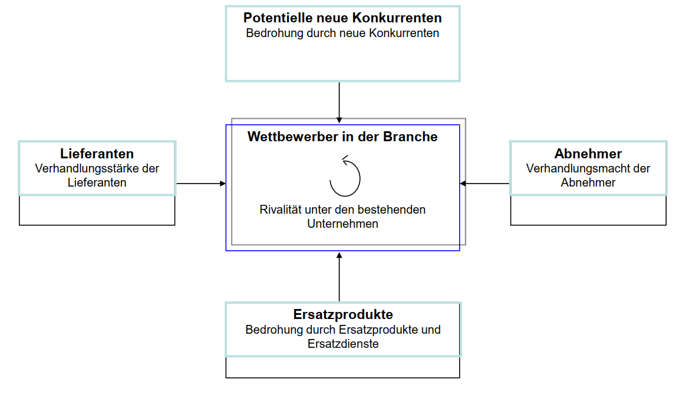
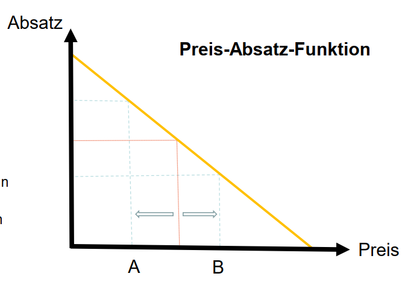

# bwl

## Was ist SWOT Analyse

_Eigenschaften eines Unternehmens identifizieren_

- Strengths (intern)
- Weaknesses (intern)
- Opportunities (extern)
- Threats (extern)

Um Stärken (Strengths), Schwächen (Weaknesses), Chancen (Opportunities) und Bedrohungen (Threats) eines Unternehmens zu identifizieren

## Was ist PEST Analyse

_Eigenschaften einer Branche untersuchen_

- Political
- Economical
- Social
- Technological

Um die politischen (Political), wirtschaftlichen (Economical), sozialen (Social) und technologischen (Technological) Einflussfaktoren auf eine Organisation, Branche oder Marktumfeld zu untersuchen

## Grundsaetze der Werbung (3Ws)

1. Wirksamkeit
2. Wahrheit
3. Wirtschaflichkeit

## 4P Modell (Marketing Mix)

_Für Planung und Umsetzung von Marketing_

- Product
- Price
- Place
- Promotion

Die vier P's stehen für Product (Produkt), Price (Preis), Place (Distribution) und Promotion (Kommunikation).
Das 4P-Modell dient als Grundlage für die strategische Planung und Umsetzung von Marketingaktivitäten

## Was ist das AIDA-Modell

_Beschreibung wie Kunden auf Marketing reagieren_

- Attention
- Intereset
- Desire
- Action

Das AIDA-Modell ist ein Marketingkonzept, das den Verkaufsprozess und die Kundenkommunikation beschreibt.

AIDA steht für Attention (Aufmerksamkeit), Interest (Interesse), Desire (Wunsch) und Action (Handlung)

## Five Forces-Modell

_Eigenschaften einer Branche und dessen Wettbewerb identifizieren_

- Wettbewerber (mitte)
- Lieferanten (links)
- Potenzielle neue Konkurrenten (oben)
- Abnehmer (rechts)
- Ersatzprodukte (unten)

Das Five Forces-Modell, auch bekannt als Fünf-Kräfte-Modell oder Branchenstrukturanalyse, wurde von Michael E. Porter entwickelt. Es ist ein Rahmenwerk zur Analyse der Wettbewerbsintensität und Attraktivität einer Branche. Das Modell basiert auf der Annahme, dass die Profitabilität eines Unternehmens von den Kräften innerhalb der Branche beeinflusst wird.

## Was ist Preisdifferenzierung

_Verschiedene Preise für dasselbe Produkt, weil Kunden unterschiedlich ticken => muss man ausnutzen!_

Preisdifferenzierung bezieht sich auf die Praxis, verschiedene Preise für dasselbe Produkt oder dieselbe Dienstleistung in unterschiedlichen Marktsegmenten, Kundengruppen oder Situationen festzulegen.

Anstatt einen einheitlichen Preis für alle Kunden anzuwenden, nutzt die Preisdifferenzierung die Unterschiede in der Zahlungsbereitschaft, dem Nutzenempfinden oder den Kaufbedingungen der Kunden, um unterschiedliche Preise festzulegen.

## Preis-Absatz-Funktion zur Preisdifferenzierung

## Bilanzidentitaet

_Summe Aktiva = Summe Passiva_

## Welche Prinzipien zur Schaffung bzw. Verteidigung von Wettbewerbsvorteilen kennen Sie?

- Konzentrationsprinzip
- Konsistenzprinzip
- Überlebensprinzip
- Chancenprinzip
- Wahrnehmungsprinzip

## Was ist Factoring

_Seine Forderungen (an sog. Factor) verkaufen_
