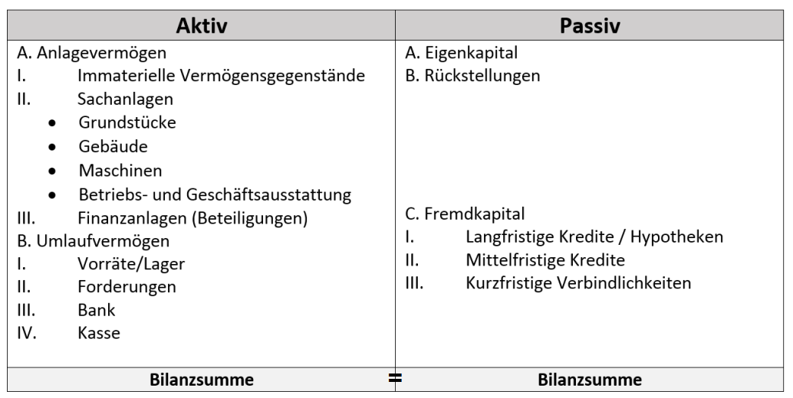
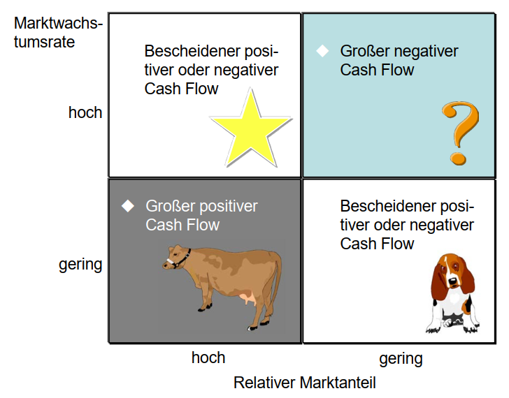
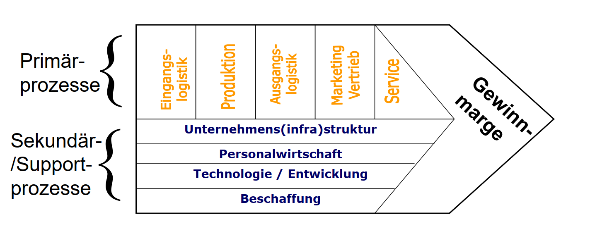

# bwl

## Wie setzt sich BIP zusammen?

Das Bruttoinlandsprodukt (BIP) umfasst den Wert aller innerhalb
eines Wirtschaftsgebietes während einer bestimmten Periode
produzierten Waren und Dienstleistungen.
(Entstehung)

Privater Verbrauch + Staatsverbrauch + Investitionen + Außenbeitrag
(Verwendung)

## Drei Verfahren der dynamischen Investitionsrechnung

- Amortisationsrechnung
- Interner Zinsfussmethode
- Kapitalwertmethode

## Kapitalgesellschaften

- GmbH
- AG

## Personengesellschaften

- GbR (Gesellschaft bürgerlichen Rechts)
- Partnerschaft
- KG (Kommanditgesellschaft)
- OHG (Offene Handelsgesellschaft)

## Vier Voraussetzungen für eine effiziente Marktsegmentierung

- Verhaltenshomogenität innerhalb der Segemente
- Verhaltensheterogenitaet zwischen Segmenten
- Wirtschaftlichkeit (ausreichende Segmentstaerke mit entsprechend grossem Nachfragepotenzial muss gegeben sein)
- Zeitliche Stabilitaet (um mittel bis langfristige Ressourcenbindung zu rechtfertigen)

## Welche zwei Barrieren führen oftmals zu Problemen in der organisatorischen Struktur eines Unternehmens?

## Formen der Aussenfinanzierung

Unternehmen nimmt Geld von externen Quellen um Ausgaben zu bezahlen.

- Eigenfinanzierung (Beteiligungsfinanzierung)

- Fremdfinanzierung (Kreditfinanzierung)

## Was ist Eigenfinanzierung(Beteiligungsfinanzierung)?

Externe Investoren investieren Geld in ein Unternehmen und erhalten im Gegenzug Anteile am Unternehmen.

- Private Equity
- Venture Capital
- Public Equity (Bei Unternehmen mit Börsenzugang)

## Was ist Venture Capital?

Investoren geben Geld an junge und innovative Unternehmen mit hohem Wachstumspotenzial, um Anteile am Unternehmen zu erhalten.

## Was ist Public Equity?

Unternehmen sammeln Kapital von der Öffentlichkeit, indem sie Aktien des Unternehmens an der Börse verkaufen.

## Was ist Private Equity

Investoren geben Kapital in bestehende Unternehmen, um sie zu unterstützen und Wertsteigerungen zu erzielen.

## Formen der Fremdfinanzierung(Kreditfinanzierung)

- Langfristige Fremdfinanzierung
  - Darlehen
  - Anleihe
- Kurzfristige Fremdfinanzierung
  - Handelskredite
  - Geldkredite
  - Kreditleihe (Akzept- und Avalkredit)
- Sonderformen (Kreditsubstitute)
  - Factoring
  - Leasing

## Was sind Anleihen/Bonds?

Anleihen sind Schuldtitel, die von Unternehmen, Regierungen oder anderen Institutionen ausgegeben werden, um Kapital von Investoren zu erhalten. Im Gegenzug für das geliehene Geld erhalten die Anleger regelmäßige Zinszahlungen und das Kapital wird ihnen am Ende der Laufzeit zurückgezahlt. Im Unterschied zu Bankkrediten können Anleihen an Börsen gehandelt werden, haben eine festgelegte Laufzeit und bieten eine gewisse Flexibilität für Investoren.

## Formen der Innenfinanzierung

- Selbstfinanzierung
- Finanzierung aus Rückstellungen
- Aus Abschreibungen
- Aus sonstigen Vermögenumschichtungen

## Was ist Selbstfinanzierung?

Selbstfinanzierung ist eine Form der Innenfinanzierung, bei der das Unternehmen seine eigenen Gewinne oder Rücklagen verwendet, um Investitionen zu finanzieren, anstatt externes Kapital aufzunehmen.

## Was ist Finanzierung aus Rückstellungen?

Finanzierung aus Rückstellungen ist eine Form der Innenfinanzierung, bei der das Unternehmen Rückstellungen, die zuvor für bestimmte Zwecke gebildet wurden, nutzt, um neue Investitionen zu finanzieren.

## Was ist Finanzierung aus Abschreibungen?

Finanzierung aus Abschreibungen ist eine Form der Innenfinanzierung, bei der das Unternehmen den Werteverzehr von Vermögensgegenständen (Abschreibungen) nutzt, um Mittel für neue Investitionen zu generieren.

## Kostenvergleichsrechnung

- statisches Verfahren
- Berechnung der Kosten pro Jahr um Investionsalternativen vergleichen zu können

Kriterium:

$$

K_{Ges}(A) < K_{Ges}(B)

$$

Wähle die Altenrative mt den geringsten Kosten

| Kaluklationsschema              |
| ------------------------------- |
| Abschreibung                    |
| + kaluklatorische Zinsen        |
| + fixe Betriebskosten           |
| + variable Betriebskosten       |
| Kosten der Alternative pro Jahr |

## Gewinnvergleichsrechnung

## Umsatzrentabilitaet

Sie zeigt an, wie effektiv ein Unternehmen seinen Umsatz in Gewinn umwandelt.

Die Umsatzrentabilität gibt an, wie viel Gewinn ein Unternehmen pro umgesetzten Euro erzielt. Ein höherer Prozentsatz bedeutet, dass ein Unternehmen effizienter arbeitet und einen größeren Anteil des Umsatzes als Gewinn behält.

_Eine magische Zahl, die uns sagt, wie gut ein Unternehmen darin ist, aus dem Umsatz Geld zu verdienen_

## Eigenkapitalrentabilitaet ROE

Return on Equity

Die Eigenkapitalrentabilität zeigt an, wie gut ein Unternehmen in der Lage ist, Gewinne mit dem von den Eigentümern investierten Geld zu erzielen. Ein höherer Prozentsatz bedeutet, dass das Unternehmen effektiv mit dem Eigenkapital arbeitet und eine gute Rendite für die Eigentümer erzielt.

## Gesamtkapitalrentabilitaet

Das Gesamtkapital umfasst sowohl das Eigenkapital als auch Fremdkapital, also die Verbindlichkeiten des Unternehmens.

## Return on invesment

Sie zeigt an, wie viel Gewinn im Verhältnis zum investierten Kapital erzielt wird

## Amortisationsrechnung

Um die Dauer zu berechnen, die benötigt wird, um eine Investition oder Anschaffung durch die erzielten Einnahmen oder Einsparungen zu decken.

## Kapitalwertmethode

(dynamische Amortisationsrechnung)

Sie berücksichtigt den Zeitwert des Geldes, indem sie alle erwarteten zukünftigen Cashflows eines Projekts auf ihren Gegenwartswert abzinst.

_Wieviel wäre eine Zahlung, die in fünf Jahren getätigt werden muss heute Wert?_

_Wieviel Geld muss ich heute bei einem Zinssatz von 10% anlegen damit ich in 5 Jahren 10.000 Euro habe?_

K = Kapitalwert

E = Einzahlungen

A = Auszahlungen

i = Kalkulationszins

## Interne Zinsfussmethode

Dasselbe wie Kapitalwertmethode, nun aber
ist der Zinssatz gesucht bei K = 0.

Ermöglicht die Berechnung der internen Rendite eines Projekts, also der Rendite, bei der der Kapitalwert der zukünftigen Cashflows gleich Null ist

Setze Kapitalwert=0 und suche den hierzu
passenden Zins r mit z.B. Regula Falsi

## Annuitätenmethode

Berechnung der Ratenzahlungen, die erforderlich sind, um einen Kredit oder eine Investition über einen bestimmten Zeitraum zurückzuzahlen

## Wie bezeichnet man die Proudktionsmenge, bei der sich die Investitionsentscheidung aendert?

Kritische Menge

## Was ist Buchführung

Buchführung ist ein System zur systematischen Erfassung, Organisation und Aufzeichnung von finanziellen Transaktionen und Geschäftsvorgängen eines Unternehmens. Es dient der Dokumentation und Überwachung der finanziellen Aktivitäten einer Organisation.

## Berechnung des BIPs

Volkswirtschaftlichegesamtrechnung

3 Formen:

- Entstehung: Wer backt unseren Kuchen?
- Verwendung: Wer isst den Kuchen auf?
- Verteilung: Alles was auf der Welt produziert wird, wird auch Konsumiert

## VGR

_Rechnungswesen des Staates_

## Quellen der VGR

Entstehung:

- Unternehmenserhebungen
- Umsatzsteuerstatistiken

Verwendung:

- Unternehmenserhebungen
- Produktionsstatistik
- KFZ-Zulassungen
- Aussehandelsstatistik

## BIP Entstehungssicht

BIP = Bruttowertschoepfung + Guetersteuern - Guetersubventionen

Wie entsteht der BIP?

- Landwirtschaft, Forstwirtschaft, Fischerei
- Baugewerbe
- Produzuriendes Gewerbe ohne Baugewerbe
- Handel und Verkehr
- Finanzierung und Vermietung
- Dienstleister

## BIP Verwendungssicht

Wie wird der BIP verwendet?

- Private Konsumausgaben von privat Haushalten oder private Organisationen
- Konsumausgaben von Staat
- Investitionen
- Aussenbeitrag

## Deckungsgrad I

Wieviel vom Anlagevermoegen ist ueber Eigenkapital gedeckt? In der Bilanz

## Deckungsgrad II

Wieviel vom Anlagevermogen ist ueber Eigenkapital inkl. lgfr. Fremdkapital gedeckt in der Bilanz?

(Sollwert >= 100%)

Wenn Deckungsgrad kleiner als 100% heisst es, dass Umlaufvermoegen
kleiner ist als kurzfristige Verbindlichkeiten -> ich kann Lieferanten nicht bezahlen ->
Anlagevermoegen ist kurzfristig nicht liquide -> schlecht

## Liquiditaet 2. Grades

Zahlungsmittel inkl. kurzfristige Forderungen
(Sollwert >= 100%)

## Erfahrungskurveneffekt

Wenn die produzierte Stueckzahl verdoppelt wird, sinkt der Produktionspreis pro Stueck
(sinkt um x%) je nach dem
von was der Erfahrungskurveneffekt zugrunde gelegt wird

z.B.
Erfahrungskurveneffekt von 25% heisst, wenn Produktion verdoppelt -> Stueckkosten sinken um 25%

## Wie kann ein Staat verhindern, dass das BIP runtergeht?

- Der Staat kann seine Ausgaben erhöhen oder die Steuern senken, um die Gesamtnachfrage anzukurbeln und dadurch die Wirtschaft anzukurbeln
- Die Zentralbank kann die Zinssätze senken, um die Kreditvergabe und Investitionstätigkeit zu fördern
- Der Staat kann Maßnahmen ergreifen, um die Wettbewerbsfähigkeit der Wirtschaft zu stärken, beispielsweise durch die Förderung von Innovation, Forschung und Entwicklung sowie die Verbesserung der Bildungssysteme und der Arbeitsmarktbedingungen
- Der Staat kann Handelsbeschränkungen lockern oder Handelsabkommen abschließen, um den internationalen Handel zu fördern und die Exporte anzukurbeln

## Zusammenhang Bilanz, Investition, Finanzierung

Eine Bilanz ist eine finanzielle Übersicht, die die Vermögenswerte, Verbindlichkeiten und das Eigenkapital eines Unternehmens zu einem bestimmten Zeitpunkt darstellt.
Eine Investition bezieht sich auf den Einsatz von Kapital zur Anschaffung von Vermögenswerten, die dazu dienen, zukünftige Einnahmen oder Vorteile zu generieren.
Finanzierung ist das beschaffen des Kapitals.

Der Zusammenhang zwischen diesen Begriffen besteht darin, dass Investitionen in Vermögenswerte Auswirkungen auf die Bilanz haben, da sie das Vermögen des Unternehmens erhöhen. Gleichzeitig benötigen Investitionen oft Finanzierung, sei es durch den Einsatz von Eigenkapital oder die Aufnahme von Fremdkapital. Die Finanzierung beeinflusst die Bilanz, da sie Verbindlichkeiten schafft, die in der Passivseite der Bilanz ausgewiesen werden. Somit sind Investition und Finanzierung eng miteinander verbunden und haben Auswirkungen auf die Bilanz eines Unternehmens.

## Bilanzstruktur

## Buchungssatzstrutktur

GV - Soll - Haben - Vol - Art - Bil. Summe

## Gehalt in der Bilanz

Gehaelter / Personal ist ein Aufwandskonto (EK)
und erhoeht sich somit im Haben

z.B.

| Soll     | Haben | Vol.   |
| -------- | ----- | ------ |
| Personal | Bank  | 10000€ |

## Akitva vs Passiva

Aktiva: Aktiva repräsentieren die Vermögenswerte eines Unternehmens. Sie umfassen Ressourcen, die dem Unternehmen einen zukünftigen wirtschaftlichen Nutzen bringen sollen. Typischerweise weisen Aktiva folgende Merkmale auf:

z.B. Sie gehören dem Unternehmen.

Passiva: Passiva repräsentieren die Verbindlichkeiten und finanziellen Verpflichtungen eines Unternehmens. Sie sind die finanziellen Ressourcen, die das Unternehmen anderen Parteien schuldet. Typischerweise weisen Passiva folgende Merkmale auf:

z.B. Sie sind Schulden oder Verpflichtungen des Unternehmens gegenüber Dritten.

## Was versteht man unter Inflation

Allgemeiner Anstieg des Preisniveaus
fuer Waren und Dienstleistungen einer
Volkswirtschaft in einem Zeitraum
Oder einfacher gesagt: Inflation ist der
Verlust an Kaufkraft einer Währung

Inflation tritt auf, wenn die Nachfrage nach Gütern und Dienstleistungen das Angebot übersteigt

## Wie wird die Inflation bestimmt

Durch Messung der Kosten von rund 600 repräsentativen Gütern und Dienstleistungen eines
typischen Haushalts (Verbraucherpreisindex)

## Leitungsspanne

Anzahl direkter Untergebene einer Fuehrungskraft.

## Leitungstiefe

Anzahl Hierarchieebenen zwischen
oberster und unterster Ebene

## Bestandskonten

Soll und Haben.
Wie in der Bilanz, Aktive positionen
erhoehen sich im Soll, passive positionen
erhoehen sich im Haben

## Erfolgskonten

Es gibt Aufwandskonten, und Ertragskonten

Aufwendungen:

- verringern EK
- Sind GV die zur Minderung des Gewinns beitragen
- Aufwendungen im Soll gebucht

Ertraege:

- erhoehen EK
- steigern den Gewinn
- Im Haben gebucht

Werden am Ende ueber das GuV Konto abgeschlossen: Aufwendungen im Soll,
Ertraege im Haben

## Was versteht man unter dem Barkapitalwert einer Investition und zu welcher Art der Investitionsrechnungsverfahren gehört diese Methode?

Der Barkapitalwert ist der auf den heutigen Tag abdiskontierte Wert des Zahlungsstroms, der
aus der Investition resultiert. Die Kapitalwertmethode gehört zu den dynamischen Verfahren der
Inverstitionsrechnung.

## Was ist das BC-Portfolio

Produkte werden anhand 2 Dimensionen bewertet:

- x-Achse: Marktwachstum niedrig - hoch
- y-Achse: relativer Marktanteil gering - hoch

Oben rechts: Fragezeichen (Selektion) - haben Potenzial aber man weiss nicht

Oben links: Stern (Investieren) - Krasser Marktanteil und krasser Wachstumspotenzial fuer die Zukunft

Unten links: Kuehe (Melken) - Solide und etabiliert fuer steady income

Unten rechts: Hund (Desinvestieren) - Sind nicht so geil

## Was ist die Wertschoepfungskette nach Porter

Zum Analysieren des gesamten Prozesses
der Wertschoepfung eines Unternehmens.
Sie beschreibt die verschiedenen Aktivitäten und Prozesse, die ein Unternehmen durchläuft, um Produkte oder Dienstleistungen herzustellen und an Kunden zu liefern.

