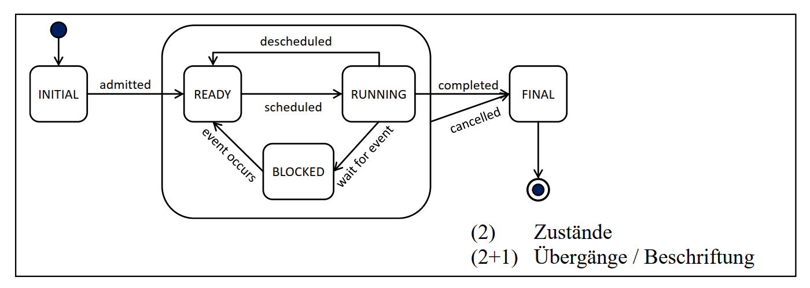
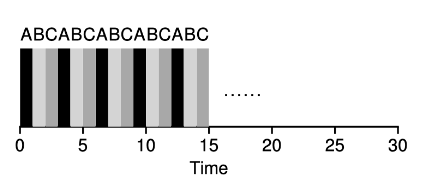
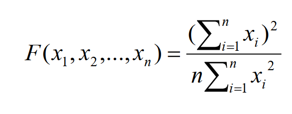
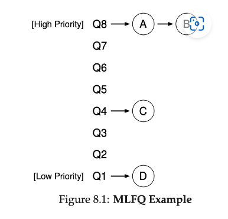
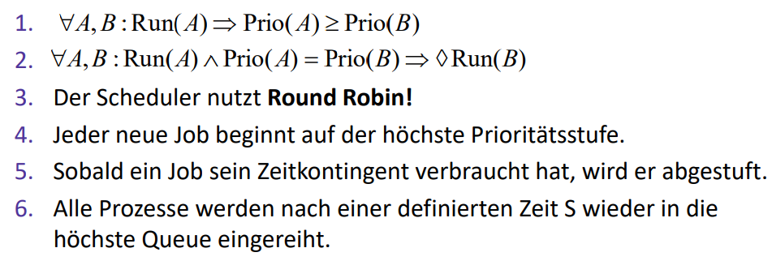
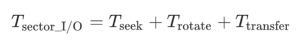
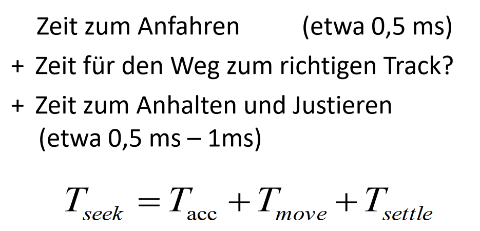
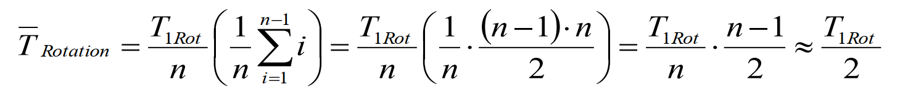
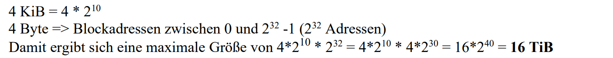
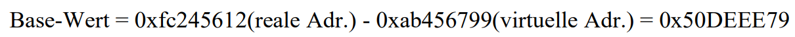

# Betriebssysteme Klausur

## Wozu benötigt man ein Betriebssystem

1. Schnittstelle zw. Hardware und Anwendungsprogrammen
2. Verwaltet die Betriebsmittel (CPU, Speicher, usw.) des Rechners und die Prozesse die auf dem Rechner ausgeführt werden
3. Sorgt dafür, dass die Betriebsmittel gerecht zwischen den einzelnen Prozessen aufgeteilt werden
4. Schirmt die einzelnen Prozesse untereinander ab, indem es Speicher und CPU virtualisiert
5. Stellt Bibliotheken bereit, um auf geschützte Systemfunktionen zuzugreifen…

## Was ist ein Prozess

1. Ist die sequentielle Ausführung eines Programms
2. Wird durch Betriebssystem verwaltet
3. Besitzt eigenen Adressraum (Speicher mit Code, Daten, Stack, Heap)
4. Zu einem Prozess gehoert auch Register (PC, SP), offene Dateien (I/O) und Netzwerkverbindungen (I/O)

## Was ist Privileged Mode

Berichtigungsklasse für BS, bei dem der ganze Befehlssatz verfügbar ist

## Was ist Restricted Mode

Auch bekannt als User Mode, bei dem normale Prozesse laufen. Befehlssatz ist eingeschränkt (LDE)

## Was ist yield

Ein Systemaufruf, bei dem ein Prozess aufgeben kann. Er wird dann wieder in die Ready-Queue des Schedulers einsortiert

## Was ist PID

Eindeutiger Name eines Prozesses, mit dem Prozesse identifiziert und verwaltet werden.

## Was ist PCB

Datenstruktur mit der das BS den Prozess verwaltet (Metadaten des Prozesses, mit z.B. PID, Prozessstatus, ...)

## Was unterscheidet ein Programm von einem Prozess?

- Programm: Ist statisch, besteht aus Code und Daten
- Prozess: Ausführung eines Programms
- 1 Programm kann viele Prozesse haben
- Prozess ist die Verwaltungseinheit des Programms, mit deren Hilfe, das Bestriebssystem die Ausführung managt

## Was ist ein Thread

Threads sind leichtgewichtige Prozesse, die sich den gleichen Adressraum teilen aber über einen
eigenen Stack und Instruction Pointer verfügen. Dabei unterscheidet man zwischen User-Level
Thread und Kernel-Level Threads.

_They are like friends working together to do things faster and help each other, just like you do when you clean your room with your friends!_

## Kernel-level Thread vs. User-level Thread

- Kernel-level Thread, ein leichtgewichtiger Prozess, der durch das Betriebssystem gemanagt wird.
- Mehrere dieser Threads können sich u.a. den gleichen Adressraum teilen, sodass Prozesse mehrere
  Kerne gleichzeitig nutzen können.

- User-level Thread, Threads innerhalb eines Prozesses.
- Die Anwendung kümmert sich selber um das Scheduling.
- Sie werden typischerweise durch die verwendete Threadbibliothek erstellt und gemanagt und sind für das
  BS unsichtbar.

## Was versteht man unter Limited Direct Execution

Abstraktion!!

1. Ein Prozess wird direkt auf der Hardware ausgefuehrt
2. Befehlssatz bleibt beschraenkt (limited)
3. Es gibt Kernel-Mode für das Betriebssysteme und User-Mode (limitiert) für die übrigen Prozesse
4. Über Hardware-Mechanismen werden sichergestellt dass ein Maschinenbefehl nur von einem Prozess benutzt werden kann, der im richtigen Mode ist.
5. Um privelegierte Befehle auszuführen müssen mittels System Call das Betriebssystem aktiviert werden.
6. Sobald ein Prozess gegen seine Berechtigung verstößt, kommt es durch die Hardware zum Prozesswechsel und das Betriebssystem wird aktiviert und informiert

## Beispiel x86-Maschinenbefehle, die nur vom BS ausgeführt werden können

- HALT
- SYSCALL
- SYSENTER
- IN
- OUT
- LTR
- LDT
  ...

## Trap Mechanismus Ablauf

- Auf CPU laueft Prozess
- Trappable Event (z.B. I/O Operation, Sofware Interrupt, Exceptions,...)
- Trap Instruction: Hebung der Rechte von User Mode zu Kernel Mode
- ...
- Event Handling: ...
- Return zu User Mode

## Ablauf Prozess will privileged Aktionen ausführen

- CPU wechselt in den Kernel Mode
- sichert den Inhalt der Register
- CPU uebergibt Trap handler und damit BS kontrolle
- BS fuehrt Systemaufruf durch
- Ergebnisse werden an definierten Stellen hinterlegt
- Trap handler restauriert die Register
- BS gibt Kontrolle wieder ab
- CPU wechselt in den gesichserten privilege Level
  und fuerht Prozess weiter aus

## Welche Funktion übernimmt der Trap Handler?

- Funktion/Routine von BS
- Implementierter Algorithmus
- Wird ausgelöst im Falle eines Interrupts
- Einstiegspunkt in das BS
- zentraler Mechanismus beim Wechsel zw. User-Mode und Kernel-Mode

## Inwiefern managet ein modernes Betriebssystem Prozesse?

- Das BS erzeugt Prozesse
- bringt sie zur Ausführung
- unterbricht sie
- wählt aus, mit welchem Prozess fortgefahren wird
- entscheidet über die Zuteilung von Ressourcen, ...

## Was unterscheidet einen Thread von einem Prozess?

- Prozess ist die Ausführung eines Programmes
- und Verwaltungseinheiten für Adressraum, Betriebsmittel usw.

- Thread wird oft als leichtgewichtiger Prozess bezeichnet
- verfügt nicht über einen eigenen Adressraum, jedoch über einen eigenen Stack
- Damit ermöglichen Threads die Nebenläufigkeit innerhalb eines Prozesses

## Warum verfügt jeder Thread über einen eigenen Stack?

- In deren Verlauf können Funktionen aufgerufen, müssen Werte zwischengespeichert oder Parameter übergeben werden…
- All diese Werte, werden implizit auf einem Stack verarbeitet
- Ein geteilter Stack würde diese Verarbeitung unmöglich machen

## Ihr Chef plant für den neuen Server einen 12-Kern-Prozessor (ohne Hyperthreading) zu beschaffen. Wie viele Prozesse befinden sich auf einem solchen System typischerweise gleichzeitig im Zustand „Running“?

Jeder Kern kann unabhängig voneinander Aufgaben ausführen. Die Anzahl der physischen Kerne auf einem Prozessor gibt normalerweise an, wie viele Threads gleichzeitig bearbeitet werden können. Da es keine Hyperthreading-Technologie gibt, die zusätzliche virtuelle Threads pro Kern erzeugt, entspricht die Anzahl der Kerne direkt der Anzahl der gleichzeitig bearbeitbaren Prozesse

Im Allgemeinen kann man davon ausgehen, dass sich pro Kern ein Prozess im Zustand „Running“
befindet. Damit wären es 12

## Kann bei Vollauslastung des Servers die Anzahl der sich im Zustand „Running“ befindenden Prozesse variieren, oder ist dies unmöglich? Begründen Sie Ihre Antwort

Ja, der Server könnte denselben Prozess dann auf mehreren Kernen in parallelen Threads laufen lassen (wegen Prio),
dann haette unter Vollast weniger als 12 Prozesse den Status "Running"

## Prozess Zustände (+ Zustandsdiagramm)

- initial: der Prozess wird erzeugt, Strukturen werden angelegt
- ready: der Prozess ist in der Lage, ausgeführt zu werden
- running: der Prozess läuft (pro CPU ein Prozess)
- blocked: der Prozess wartet auf ein bestimmtes Ereignis (z.B.: I/O)
- final: der Prozess ist beendet, es wird aufgeräumt

## Wie kann diese Abschirmung erreicht werden und welche Rollen übernehmen dabei Betriebssystem und Hardware?

- Virtualisierung der Umgebung
- Beschneidung von Rechten

- Hardware realisiert dies technisch
- Betriebssystem verwaltet die Rechte, kuemmert sich um Zuteilung,...

## Wozu benötigt man ein Protection-Ring-Konzept und wofür stehen die unterschiedlichen Ringe (bzw. Level)? Wofür werden sie gebraucht?

- Unterschiedle Ringe dienen Absicherung im Sinne von LDE
- Einige Befehle sollen nur von berechtigten Prozessen ausgefuehrt werden.
- User mode: Protection Level mit niedrigsten Privilegien (ring3)
- Kernel mode: Meiste Rechte (ring0)

## Vorteil von mehr als 2 Ringen?

- Weniger Overhead durch weniger Ringwechsel bei gleicher Sicherheit
- Granularere Abstufungen der Rechte

## Was ist FIFO Strategie

FIFO - First In First Out

Aufgaben werden in der Reihenfolge bearbeitet, in der sie ankommen

## Unter welchen Umstaenden ist FIFO gut

FIFO ist nur dann eine adäquate Strategie, wenn sich die unterschiedlichen Aufgaben hinsichtlich
einer Metrik **gleich** verhalten. Lassen sich also Aufgaben in gleichartige Gruppen einteilen, dann
kann innerhalb der Gruppe auf eine FIFO-Strategie zurückgegriffen werden.

## Was ist SJF und wann ist es gut

Shortest Job First

Gut wenn alle Aufgaben zur gleichen Zeit ankommen

## Was ist STCF und wann ist es gut

Shortest-Time-to-Completion-First.

Ist ziemlich gut, aber Computer sind interaktiv!

## Was ist RR

- Time-slicing scheduling
- Recht fair
- Aber schlechte Umlaufzeit

## Wann spricht man von einer fairen Scheduling-Strategie?

- CPU wird in einem **Zeitraum** wird in gleiche Teile aufgeteilt
- Erfordert **präemptiven Scheduler** (Kann laufende Prozesse stoppen und starten)
- Es gibt **Fairness-Index**, je näher der Wert bei 1 desto gerechter

## Fairness-Index

## Turnaround time

$$
T_{Umlauf} = T_{Ende} + T_{Ankunft}
$$

## Response time

$$
T_{Reaktion} = T_{Start} + T_{Ankunft}
$$

## Was ist MLFQ

Multi-Level Feedback Queue

- I/O-Zeit wird nun beruecksichtigt
- Es gibt mehrere abgegrenzte Queues mit unterschiedlichen priority-Leveln
- If $\text{priority}(A) > \text{priority}(B)$, dann wird $A$ bearbeitet
- If $\text{priority}(A) = \text{priority}(B)$, dann laufen A und B in Round Robin (RR)

## Sind optimale Umlaufzeiten bei kürzesten Reaktionszeiten moeglich?

Nein, das ist widerspruechlich

## Was ist Lottery-Scheduling

- Es minimiert nicht Turnaround-Zeit, sondern
  teilt CPU-Zeit fair auf
- Es arbeitet mit Zeitschlitzen
- Jede Aufgabe erhält Lose entsprechend ihrer Priorität
- Je nach Zufallsquelle abhängig wie gut es ist
- Sollte man nicht benuzten deshalbe weil gute Zufallsgeneratoren aufwendig und langsam sind

## Was ist ein Sektor

- Kleinster Teil der Platte, der angesprochen werden kann.
- Typischerweise 512 Byte

## Was ist ein Spur

- Kreis aus mehreren Sektoren
- Auch Track genannt

## Was ist ein Zylinder

- Alle Spuren in derselben Position des SLK

## Durche welche Größen wird die Zugriffszeit von Daten auf einer Festplatte bestimmt

- Seek-time (Zeit zum Positionieren)
- Latenzzeit (Rotationsverzögerung)
- Übertragungszeit (Transfer)

## Was ist FCFS

I/O Scheduling - First Come First Serve

- Abarbeitung der Anfragen nach Reihenfolge

## Was ist SPTF

I/O Scheduling - Shortest-Positioning-Time-First

## Seek Time berechnen

## Latenzzeit (Rotation) berechnen

_Rotationszeit = Von r/m(rpm) in ms/r umwandeln, dann durch 2_

$$
\overline{T}_{Rotation} \approx \frac{T_{1Rot}}{2}
$$

## Warum ist es sinnvoll, sowohl vor dem Schreiben als auch vor dem Lesen von Daten, die entsprechenden Anfragen bei einer herkömmlichen Festplatte in eine definierte Reihenfolge zu bringen? Welche Informationen sind für die Festlegung der Reihenfolge von Vorteil?

- SLK muss auf Track positioniert werden
- Dann muss SLK auf Sektor positioniert werden
  -> Sortieren sinnvoll fuer optimalere Bewegung
- Man orientiert sich an Zylinder
- Wenn nicht bekannt, dann Blockadresse approximation

## Inwiefern lässt sich, durch den Einsatz von Strategien wie SSTF und NBF, diese Zugriffszeit reduzieren und dadurch der tatsächliche Durchsatz erhöhen?

- SSTF (Shortest seek time first)
- Reihenfolge nach Zylinderposition

- NBF (Nearest Block first)
- Reihenfloge nach Blockadresse
- Idee: Logische Adressen, die nahe sind, liegen auch physischen nahe beianander
- Ist nur richtig, wenn sich Adressen nicht auf unterschiedlichen Plattentellern sind

## Wie optimieren SCAN-Algorithmen den Plattenzugriff und welcher Nachteil der SSTF und NBF Strategien wird dadurch kompensiert?

- SCAN-Algorithmen bringen Fairness ins Spiel
- Vermeiden Starvation (weit entfernte Anfragen)
- Arm bewegt sich wie Fahrstuhl von innen nach aussen, dann wieder zurueck
- Anfragen werden nach bevorstehenden Armbewegung sortiert

## F-SCAN

- Freeze
- Anfragen stehen zu beginn fest
- Alle Anfragen während der
  Bewegung werden gequeuet und erst auf dem Rückweg bearbeitet

## C-SCAN

- Circular
- Bewegungsrichtung steht fest
- Anfragen werden nur in einer Richtung bearbeitet. - Sobald das Ende
  erreicht ist, springt der Arm zurück und startet von neuem

## Warum ist es sinnvoll, vor dem Schreiben von Daten, die entsprechenden Anfragen bei einer SSD in eine definierte Reihenfolge zu bringen?

- Für scheduling
- Kostspielige Flash-operationen können reduziert werden, die SSD zerstören
- Lebensdauer wird verbessert (nicht Geschwindigkeit)

## Welche Informationen sind für die Festlegung der Reihenfolge von Vorteil? (Bei SSD Anfragen)

- Informationen über den Block
- Seite
- Ändererungswahrscheinlichkeit der Seite

Letztendlich muss entschieden werden, ob die Seite in einen neuen Block verschoben wird oder
der betreffende Block gelöscht werden kann und neu beschrieben werden soll.

## Was sind Pages und Block in SSDs?

- Page: (viele Zellen)
  Es kann immer nur eine komplette
  Page gelesen oder geschrieben
  werden (2KiB – 8KiB)

- Block: (mehrere Pages)
  Es kann immer nur ein kompletter Block gelöscht
  werden (256 KiB – 1MiB)

## Wozu dient der FTL?

- Flash Translation Layer
- Mappt virtuelle Block-Adressen auf die realen  
  Seiten der SSD
- Beim Schreiben (damit das Löschen von ganzer
  Bloecke) kommt es evtl. zum Verschieben von gueltigen Seiten -> Muss verborgen werden -> Uebersetzung notwendig

## Welche Vorteile ergeben sich, wenn man Pages einer SSD aufgrund der erwarteten Änderungshäufigkeiten in unterschiedliche Gruppen einteilt?

- Platzbedarf fuer FTL ist reduziert
- Gemeinsame Uebersetzung vieler Seiten reduziert Anzahl Operationen -> Lebensdauer besser

## Ein neues, für SSDs optimiertes Dateisystem, setzt auf Blockgrößen von 4 KiB und Blockadressen von 4 Byte. Welche maximale Festplattengröße kann damit formatiert werden?

## Was müssen Sie tun, um das 1.000.000. Byte einer 3 MiB großen Datei zu lesen? (Blockgroesse 2 KiB)

- Der Byte 1.000.000. Byte befindet sich im Block 999.999/2048 (Bytes fangen bei 0 an) = 488,irgendwas
- Also braucht man den 489 Block (fangen auch bei 0 an) und liest ihn

## Was muss getan werden, wenn man ein Byte einer Datei aendert

- Kompletter Block muss neu geschrieben werden

## Ein nicht näher definiertes Dateisystem nutzt zur Speicherung von Daten Blöcke der Größe 512 Byte. Was steht in den letzten 24 Byte des zweiten Blocks? Wenn Ihre Datei nur 1000 Byte umfasst?

24 nicht vorhersehbare Werte zwischen 0 und 255!

## Wie kann es sein, dass eine fabrikneue, frisch formatierte SSD, die laut Hersteller Platz für 1TiB bietet, bereits nach dem Schreiben von deutlich weniger als 1 TiB voll ist? Kann dies auch bei einer HDD vorkommen?

- Page ist gross -> viele kleine Dateien brauchen mehr Platz als deren Inhalt
- Meta-strukturen brauchen auch Platz (I-Map, D-map)

## FAT Dateisystem

FAT = Dateiname <-> Speicheradresse

## Inode

- Datenstruktur, die Metadaten über eine Datei speichert (Jede Datei, und jeder Ordner hat eine Inode)

- Dateigroesse, Rechte, Timestamps, Ownership, Pointer zu Datenbloecken

## I-Map

- Inode Map
- Trackt den Zuweisungsstatus von Inodes.
- Bitvektor/Bitmap aus 1 und 0, wo jedes zeigt ob bereits Inode da ist.

## D-Map

- Data Map
- Trackt Zuweisungsstatus von Datenbloecken
- Auch ein Bitvektor aus 1 und 0, die sagt, ob der Datenblock einer Datei zugewiesen ist

## Welche Vor- und Nachteile ergeben sich bei einer Segmentierung des Speichers?

- Vorteil:
  - individuelle Abbildung pro Segement
  - individuelle Rechte
  - individuelle dynamische Anapassung der Groesse
- Nachteil:
  - Segmente sind grosse zusammenhaengende Einheiten die viel Platz brauchen
  - Fragmentierung des RAMs

## MMU

- memory management unit
- Uebersetzt Virtualisierte Adresse zu Physische Adresse

## Welche Informationen muss die MMU zu jedem Segment mindestens verwalten?

Anfang (Base-Adresse), Größe (Bound-Adresse), Wuchsrichtung (positiv/negativ)

## Das wievielte Segment von vier Segmenten wird durch die virtuelle 32-Bit-Adresse 0x91BE2311 adressiert

Das dritte Segment, da bei 4 Segmenten die ersten 2 Bits (hier 9 = 1001 => 10 => 3, es beginnt bei 0) das Segment identifizieren (Bei 6 Segmenten die ersten 3 Bits)

## Wie lautet die virtuelle Adresse des ersten Bytes, das auf dem Stack liegt (bei von 0x91BE2311 adressiertem Segment ist das Stacksegment)

9F FF FF FF

## Base annd Bounds

- Virtuelle Adresse wird geprueft ob sie Bound-Adresse ueberschreitet
- Falls gueltig, dann Base Adresse wird hinzu addiert, um die physische Adresse zu bekommen

## Sei 0xab456799 eine virtuelle 32-Bit-Adresse und 0xfc245612 die dazu gehörende reale physische Adresse. (Virtualisierung mittels Base-and-Bounds)Welcher Wert steht offensichtlich im Base-Register?

## Was bezeichnet man bei einer virtuellen Adresse mit VPN und Offset?

Eine Adresse setzt sich aus VPN (Virtual Page Number) und Offset (Distanzadresse) zusammen.
Über die VPN wird das Frame adressiert und über den Offset das Byte im Frame.

## Page Table

virtual page number (VPN) to physical frame number (PFN, or PPN)

## Welche Beziehung besteht zwischen der Größe eines Page Frames und der Distanzadresse?

Die Größe des Offsets ergibt sich aus der Größe eines Page Frames. Bei 2 KiB (211 Byte) sind dies
11 Bit
